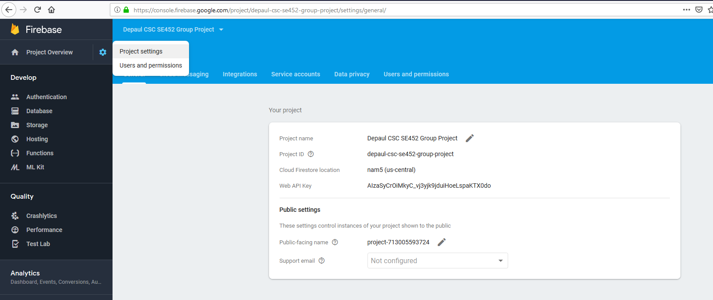
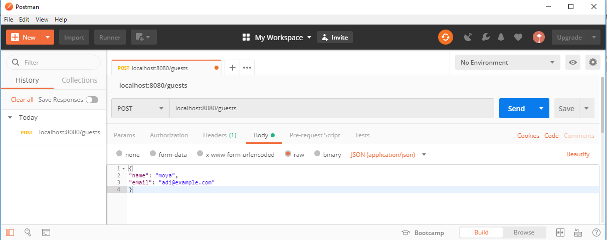
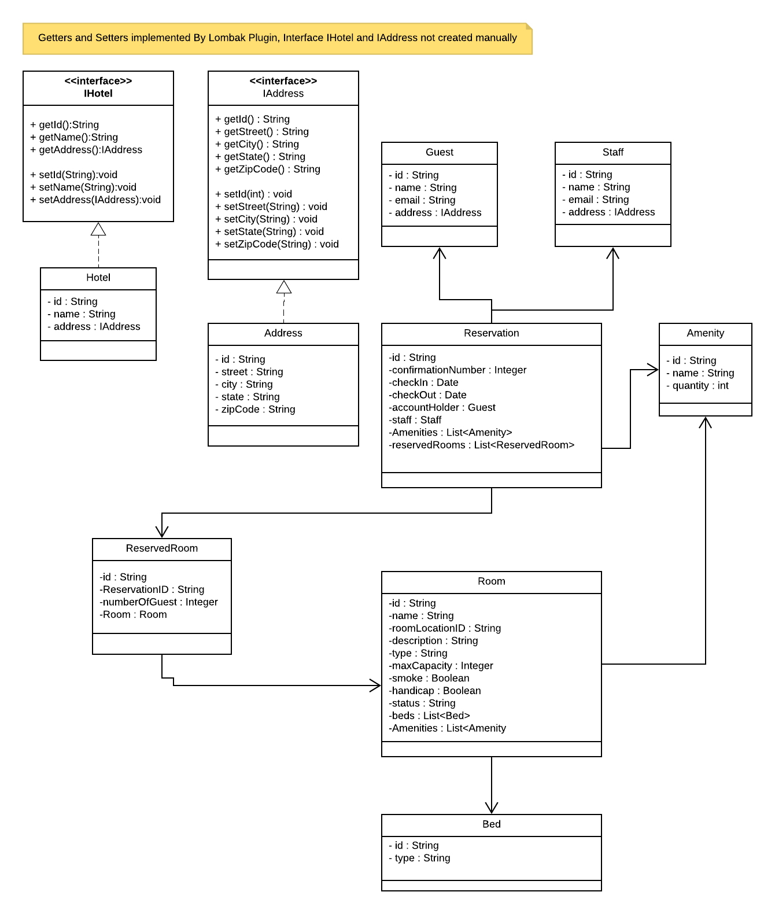

# Hotel Reservation


*****
# Database Managers:

 1. Firebase
	  https://firebase.google.com
	  https://firebase.google.com/docs/database/android/read-and-write
 2. MongoDB
 3. Fake data - a List data structure

##How to switch database manager

To switch to a different database manager, change the name of the  [@Qualifier](https://www.logicbig.com/tutorials/spring-framework/spring-core/inject-bean-by-name.html)
In the database service


##| Table : Guest  
```java

@Service
public class GuestService {

    @Autowired
    @Qualifier("mongoGuestData")
    private IGuestDao guestDao;

    ....
}
```

|------------------------------------------------------------------------------------------|
| Table : Guest                                                                            |
|------------------------------------------------------------------------------------------|
| Database  | @Qualifier        | Sample Code                                              |
|-----------|-------------------|----------------------------------------------------------|
| Firebase  | firebaseGuestData | ```java                                                  |
|           |                   | @Repository                                              |
|           |                   | @Qualifier("firebaseGuestData")                          |
|           |                   | public class FirebaseGuestDaoImpl implements IGuestDao { |
|           |                   |     ....                                                 |
|           |                   | }                                                        |
|           |                   | ```                                                      |
|-----------|-------------------|----------------------------------------------------------|
| MongoDb   | mongoGuestData    | ```java                                                  |
|           |                   |                                                          |
|           |                   | @Repository                                              |
|           |                   | @Qualifier("mongoGuestData")                             |
|           |                   | public class MongoGuestDaoImpl implements IGuestDao{     |
|           |                   |     ....                                                 |
|           |                   | }                                                        |
|           |                   | ```                                                      |
|-----------|-------------------|----------------------------------------------------------|
| FakeGuest | fakeGuestData     | ```java                                                  |
|           |                   | @Repository                                              |
|           |                   | @Qualifier("fakeGuestData")                              |
|           |                   | public class FakeGuestDaoImpl implements IGuestDao {     |
|           |                   |     ....                                                 |
|           |                   | }                                                        |
|           |                   | ```                                                      |
|-----------|-------------------|----------------------------------------------------------|
<sub>Table created with: https://www.tablesgenerator.com/text_tables</sub>


*****
# Getting the application Running Guide


## Firebase server admin

https://firebase.google.com/docs/admin/setup

## Add Firebase to your app

>To use the Firebase Admin SDKs, you'll need a Firebase project, a service account to communicate with the Firebase service, >and a configuration file with your service account's credentials. 

>If you don't already have a Firebase project, add one in the Firebase console[https://console.firebase.google.com/]. 
>

**rename the JSON File to "service_account.json"**

```sh
src\main\resources
```

In the sources folder, add the resource file:  src/main/resources/service_account.json





## Create the **application.properties file**

Spring Boot gives you defaults on all things, the default in database is H2, so when you want to change this and use any other database you must define the connection attributes in the application.properties file.

In the sources folder, you create a resource file src/main/resources/application.properties

```sh
#Firebase configuration
rs.firebase.database.url=https://group-project.firebaseio.com
rs.firebase.config.path=service_account.json

# Mongo database URI. Cannot be set with host, port and credentials.
# 

spring.data.mongodb.host=localhost 
spring.data.mongodb.port=27017   
spring.data.mongodb.database=hotelreservation
spring.data.mongodb.username=hoteladmin
spring.data.mongodb.password=sdr$%3w43@123
```

*****


##Rest API testing tool
https://www.getpostman.com/


REST API Examples

INSERT: **POST** method
url:  localhost:8080/guests 
Body - raw - JSON(application/json)

```javascript
{
    "name": "kim",
    "email": "wedrt@example.com"
}
```

```javascript
{
"name": "moya",
"email": "adi@example.com"
}
```


SELECT by id: **GET** method
url:  localhost:8080/guests/id/5cbd4d118f10f904687a4b2d

DELETE by id: **DELETE** method
url:  localhost:8080/guests/id/5cbd4d118f10f904687a4b2d


UPDATE: **PUT** method
url:  localhost:8080/guests 
Body - raw - JSON(application/json)

```javascript
{
    "id": "5cbd4d118f10f904687a4b2d",
    "name": "kim white",
    "email": "twiceto@example.com"
}
```

# UML



# How to make contributions?
This is a group project, sorry you cannot contribute unless you are a part of the group